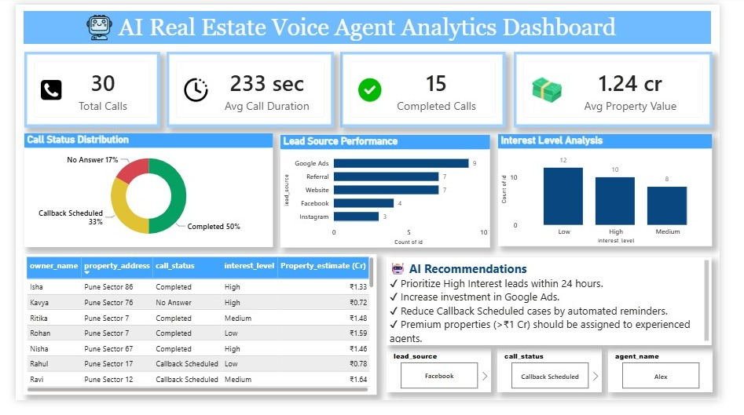

# 🏡 Real Estate AI Voice Agent Analytics Dashboard

An interactive Power BI dashboard designed to analyze AI voice agent interactions, lead generation, customer engagement, and overall business performance in the real estate industry.

## Short Description / Purpose

This Power BI dashboard provides insights into AI voice agent conversations, lead status, customer interactions, and agent performance. It helps businesses monitor communication efficiency, evaluate lead conversion trends, and make data-driven decisions to improve customer engagement.

## Tech Stack

The dashboard was built using the following tools and technologies:

* 📊 Power BI Desktop – Main platform used for report creation and visualization.
* 📂 Power Query – Used for data cleaning and transformation.
* 🧮 DAX (Data Analysis Expressions) – Used for calculated measures, KPIs, and dynamic reporting.
* 🗄️ SQL – Used for creating and managing the project database.
* 🔗 Data Modeling – Relationships established among tables for accurate analysis.
* 📄 File Format – .pbix for development and .png/.jpeg for dashboard preview.

## Data Source

The dashboard is based on real estate customer interaction data generated through an AI Voice Agent system. The dataset includes customer inquiries, property interests, lead status, call outcomes, response times, and conversation details.

## Features / Highlights

### Business Problem

Real estate businesses receive numerous customer inquiries every day, making it difficult to manually track conversations, monitor lead quality, and measure agent performance. Without proper analytics, identifying conversion opportunities and customer behavior becomes challenging.

### Goal of the Dashboard

* Monitor AI voice agent interactions.
* Analyze lead generation and conversion trends.
* Track customer engagement and call outcomes.
* Measure agent performance and response efficiency.
* Support data-driven business decisions.

### Key Visuals

* KPI cards for Total Calls, Total Leads, Qualified Leads, and Conversion Rate.
* Lead status distribution.
* Call outcome analysis.
* Customer interaction trends.
* Property inquiry insights.
* Agent performance metrics.

### Business Impact & Insights

* Identified trends in customer inquiries and lead generation.
* Improved visibility into AI voice agent performance.
* Helped analyze lead conversion opportunities.
* Supported faster and data-driven business decision-making.

## Dashboard Preview

